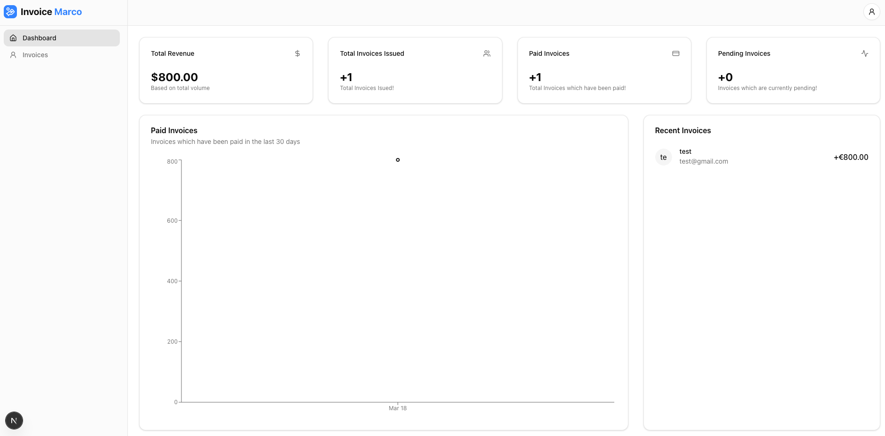

# InvoiceMarco - Modern Invoice Management System

InvoiceMarco is a modern, full-stack invoice management application built with Next.js 15 and TypeScript. It provides a seamless experience for creating, managing, and sending professional invoices.



## 🚀 Features

- 📝 Create and manage professional invoices
- 🎨 Modern, responsive UI with dark mode support
- 🔐 Secure authentication with NextAuth.js
- 📊 PDF generation for invoices
- 📧 Email notifications via Mailtrap
- 📱 Mobile-friendly design
- 🌈 Beautiful UI components with shadcn/ui
- 📈 Data visualization with Recharts
- 🔄 Real-time updates with Turbopack

## 🛠 Tech Stack

- **Framework:** Next.js 15 with App Router
- **Language:** TypeScript
- **Styling:** Tailwind CSS
- **UI Components:** shadcn/ui
- **Database:** PostgreSQL with Prisma ORM
- **Authentication:** NextAuth.js
- **PDF Generation:** jsPDF
- **Email:** Mailtrap & Nodemailer
- **Form Validation:** Zod & Conform
- **Date Handling:** date-fns
- **Icons:** Lucide React
- **Charts:** Recharts
- **Notifications:** Sonner
- **Code Quality:** Biome (Linting & Formatting)

## 🏁 Getting Started

1. Clone the repository
2. Install dependencies:
```bash
pnpm install
```

3. Set up your environment variables:
```bash
cp .env.example .env.local
```

4. Run the development server:
```bash
pnpm dev
```

Open [http://localhost:3000](http://localhost:3000) with your browser to see the result.

## 🔧 Development

- `pnpm dev` - Start development server with Turbopack
- `pnpm build` - Build for production
- `pnpm start` - Start production server
- `pnpm lint` - Run Biome linter
- `pnpm format` - Format code with Biome
- `pnpm check` - Run Biome check and apply fixes
- `pnpm postinstall` - Generate Prisma client

## 📚 Documentation

- [Next.js Documentation](https://nextjs.org/docs)
- [Prisma Documentation](https://www.prisma.io/docs)
- [Tailwind CSS Documentation](https://tailwindcss.com/docs)
- [shadcn/ui Documentation](https://ui.shadcn.com)
- [Biome Documentation](https://biomejs.dev/docs)

## 🚀 Deployment

The easiest way to deploy your Next.js app is to use the [Vercel Platform](https://vercel.com/new?utm_medium=default-template&filter=next.js&utm_source=create-next-app&utm_campaign=create-next-app-readme) from the creators of Next.js.

## 📝 License

This project is licensed under the MIT License.
